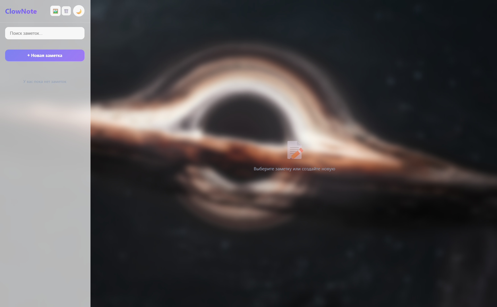

# ClowNote

Простое и удобное веб-приложение для создания заметок.

**Demo:** [clow-note.vercel.app](https://clow-note.vercel.app/)




## Руководство
Фон добавляется персонально (до 10 мб), можно удалить. При обновлении страницы фон удаляется.
Пока сильно нету функций заметок, можно лишь добавить фото или записать что-либо.
Заметки сохраняются при обновлении страницы, но не при закрытии.

## Технологии
- React 18
- Vite
- CSS Modules

## Запуск локально
```bash
npm install
npm run dev